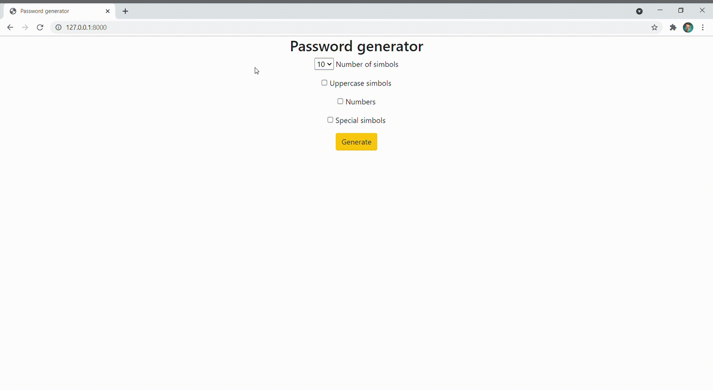

Password generator
==================

A web service for password generation.

This is a simple Django project that can be written in 30 minutes and repeats the example from Chapter 1 of the training course ["Django 3 - Full Stack Websites with Python Web Development"](https://www.udemy.com/course/django-3-make-websites-with-python-tutorial-beginner-learn-bootstrap/).

